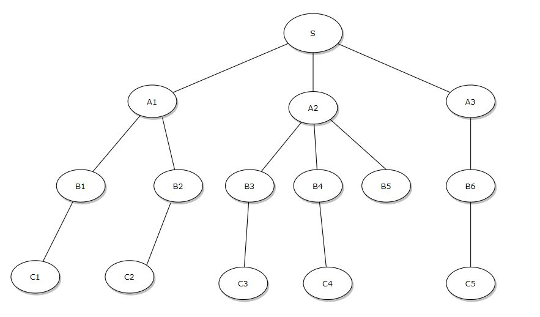
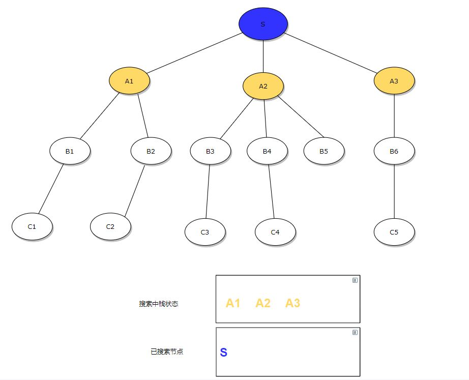
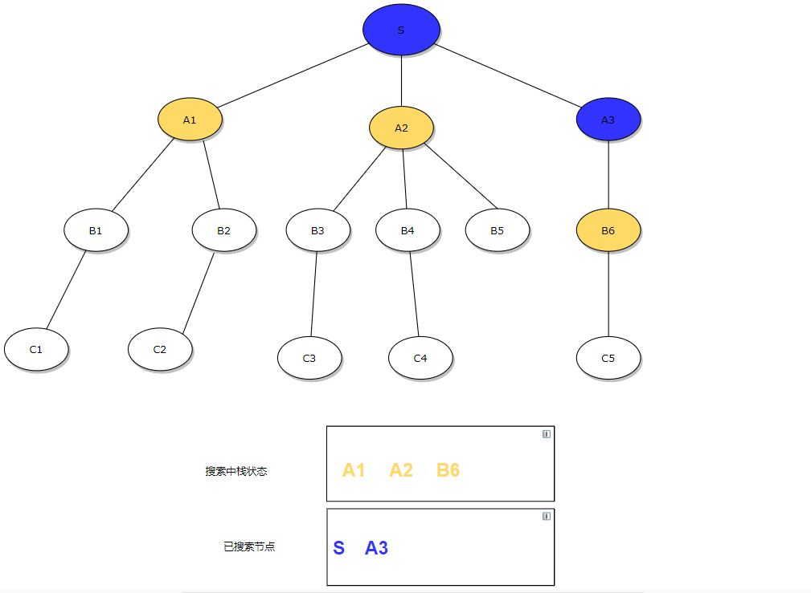
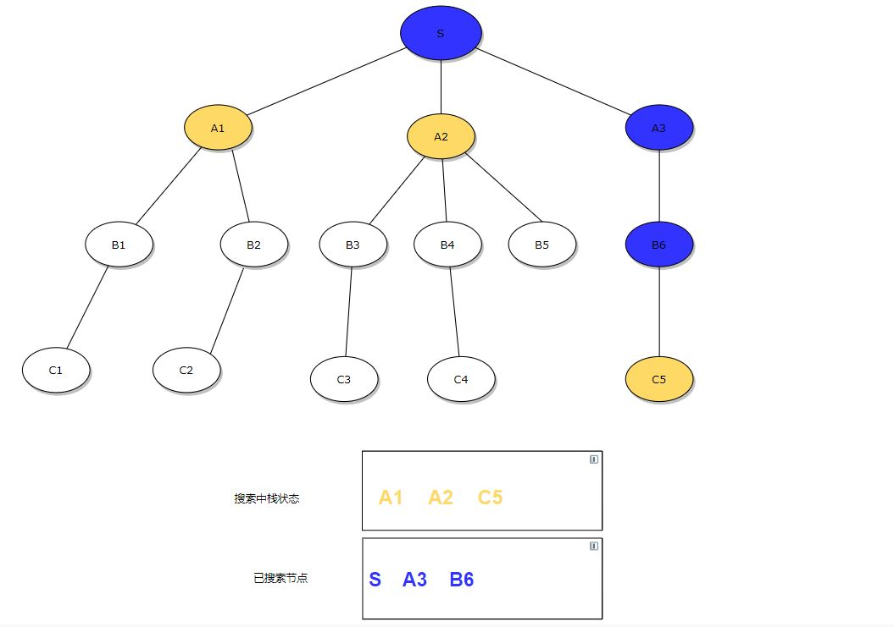
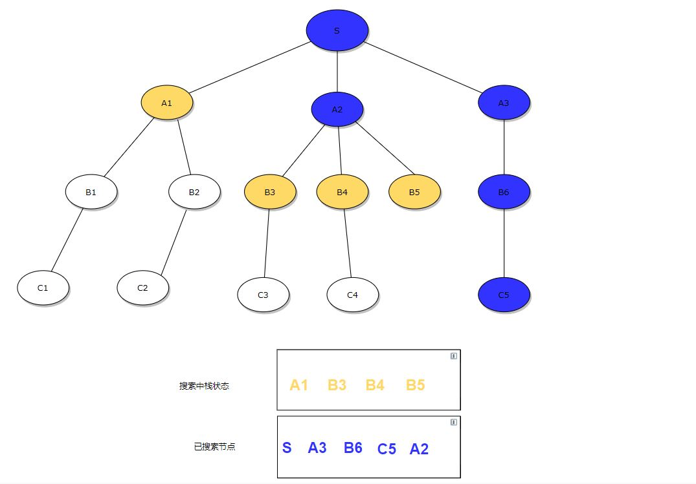
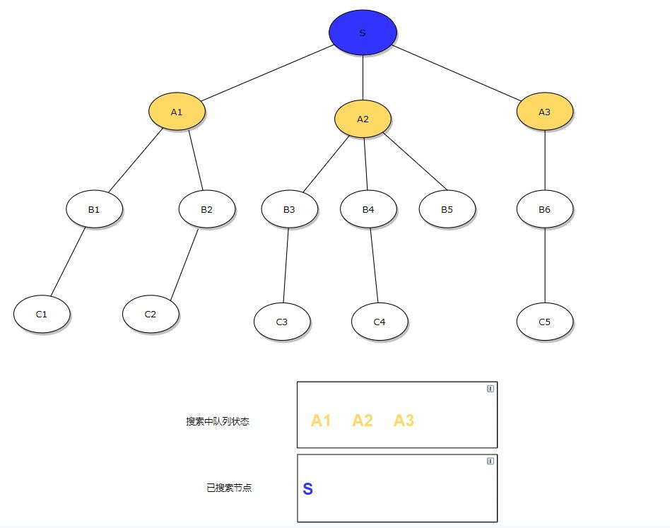
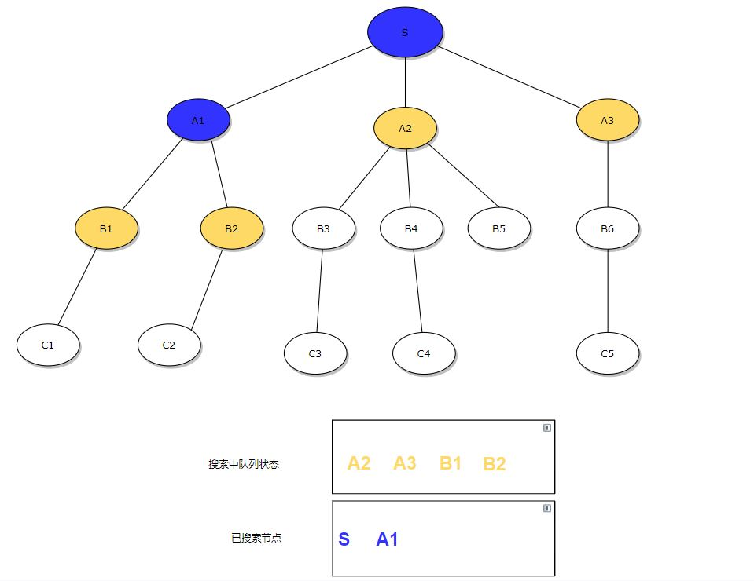
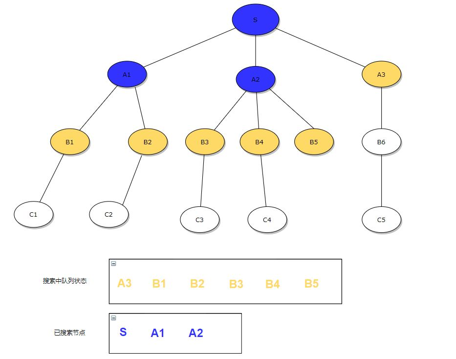
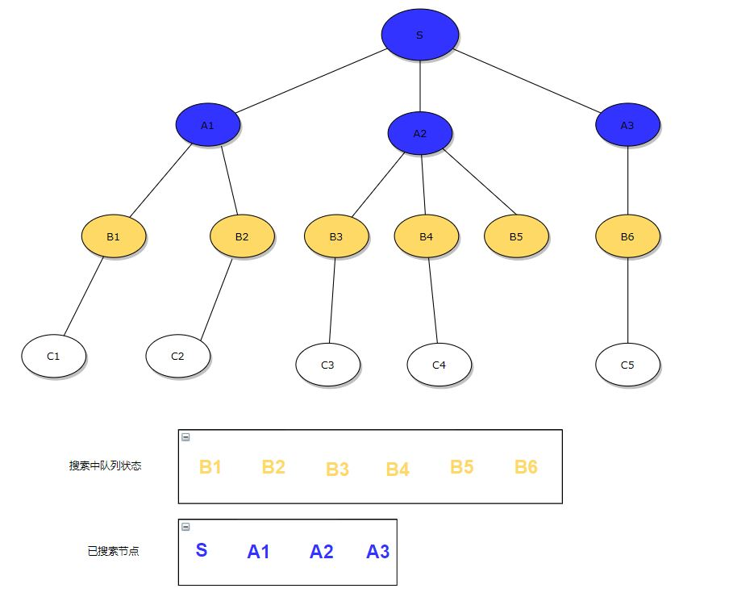

图算法
深度优先和广度优先

参考：https://zhuanlan.zhihu.com/p/74472146

1. 深度优先搜索
  深度优先， 使用了先进后出实现，类似于数据结构里面的栈

当使用深度优先搜索图时，先使用栈来保存搜索中的状态

起点为S，与S相邻有3个节点A1，A2, A3 当按A1-A3的顺序搜索时，将A1-A3依次入栈，则栈中元素为A1, A2, A3；

A3出栈，同时将B6入栈

B6出栈，C5入栈

C5出栈，C5相邻已经没有节点，则继续从栈中取出A2, 将A2相邻的B3,B4，B5入栈

然后B5出栈，搜索节点【S->A3->B6->C5->A2->B5】，栈中剩下【A1 -> B3 -> B4】

然后B4出栈，C4入栈，搜索节点【S->A3->B6->C5->A2->B5->B4】，栈中剩下【A1 -> B3 -> C4】

然后C4出栈，搜索节点【S->A3->B6->C5->A2->B5->B4->C4】，栈中剩下【A1 -> B3 】

然后B3出栈，C2入栈，搜索节点【S->A3->B6->C5->A2->B5->B4->C4->B3】，栈中剩下【A1 -> C3 】

然后C3出栈，搜索节点【S->A3->B6->C5->A2->B5->B4->C4->B3->C3】，栈中剩下【A1】

然后A1出栈，B1,B2入栈，搜索节点【S->A3->B6->C5->A2->B5->B4->C4->B3->C3->A1】，栈中剩下【B1 ->B2】

然后B2出栈，C2入栈，搜索节点【S->A3->B6->C5->A2->B5->B4->C4->B3->C3->A1->B2】，栈中剩下【B1 ->C2】

然后C2出栈，搜索节点【S->A3->B6->C5->A2->B5->B4->C4->B3->C3->A1->B2->C2】，栈中剩下【B1】

然后B1出栈，C1入栈，搜索节点【S->A3->B6->C5->A2->B5->B4->C4->B3->C3->A1->B2->C2->B1】，栈中剩下【C1】

然后C1出栈，搜索节点【S->A3->B6->C5->A2->B5->B4->C4->B3->C3->A1->B2->C2->B1->C1】，栈空，结束搜索，则最后搜索顺序为：S->A3->B6->C5->A2->B5->B4->C4->B3->C3->A1->B2->C2->B1->C1

2. 广度优先搜索

先进先出，类似于数据结构里面的队列

起点为S，与S相邻有3个节点A1，A2, A3 当按A1-A3的顺序搜索时，将A1-A3依次入队列，则队列中元素为A1, A2, A3；

队列是先进先出，所以先出A1, 同时将A1的相邻节点加入队列

然后是A2出，并将B3 B4 B5加入队列

然后A3出列，并将B6入列

然后B1出列，C1入列，已搜索【S->A1->A2->A3->B1】，列中【B2->B3->B4->B5->B6->C1】

然后B2出列，C2入列，已搜索【S->A1->A2->A3->B1->B2】，列中【 B3->B4->B5->B6->C1->C2】

然后B3出列，C3入列，已搜索【S->A1->A2->A3->B1>B2>B3】，列中【B4->B5->B6->C1->C2->C3】

然后B4出列，C4入列，已搜索【S->A1->A2->A3->B1>B2>B3->B4】，列中【B5->B6->C1->C2->C3->C4】

然后B5出列，已搜索【S->A1->A2->A3->B1>B2>B3->B4->B5】，列中【B6->C1->C2->C3->C4】

然后B6出列，C5入列，已搜索【S->A1->A2->A3->B1>B2>B3->B4->B5->B6】，列中【C1->C2->C3->C4->C5】

最后C1,C2,C3,C4,C5依次出列，最终搜索顺序为

S->A1->A2->A3->B1>B2>B3->B4->B5->B6->C1->C2->C3->C4->C5
